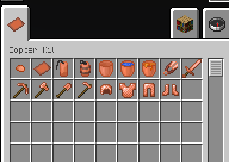

# Introduction

Sorry, due to the author's limited energy, we are unable to develop a mod that supports multiple loaders. Currently, we only support neoforge, and we estimate that it will be gradually supported in the future (but we cannot guarantee it)

This is a simple copper-based expansion module that provides more practical recipes, including various tools, armor and other items;

That's all 🤪🤪🤪

maybe i will write a developer guide for this mod in the future, but i am too lazy to do it now

 

# Modules

## Items and Blocks

we add following items and blocks

just for now, yes, if i have more time to do it, i will add more  

 

## Recipes

Because this mod adds a lot of things, you can choose to install JEI to view the corresponding item's recipe. The space here is too small to display all the recipes